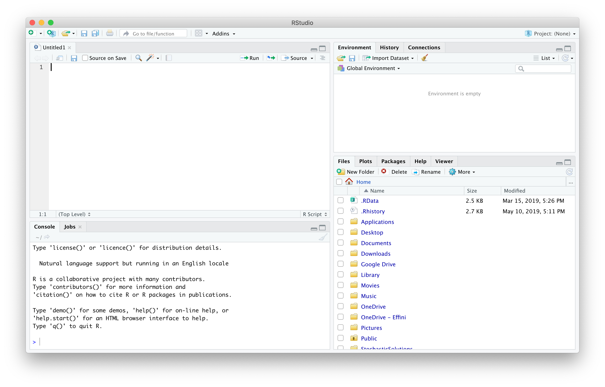
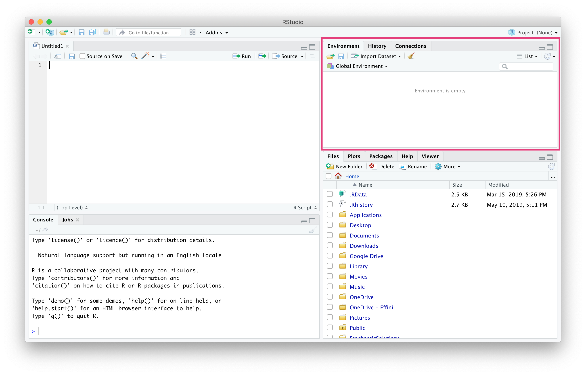
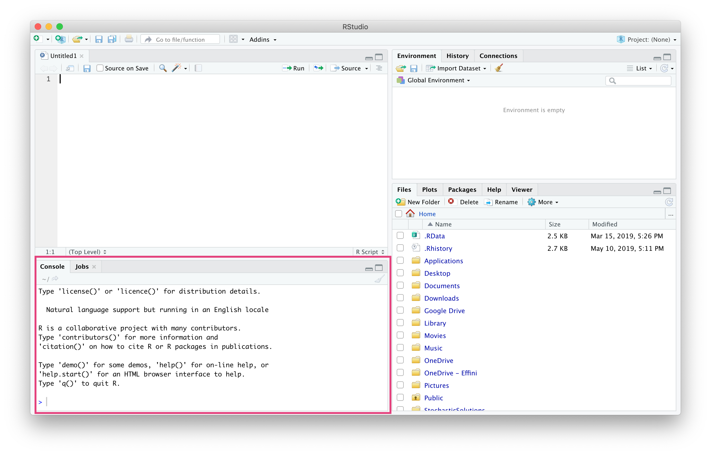
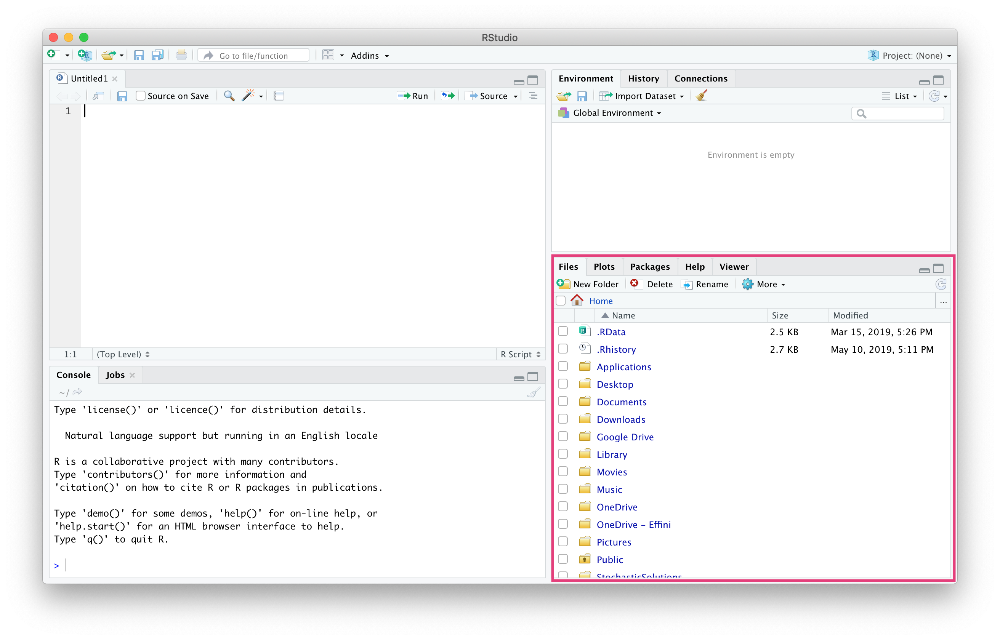
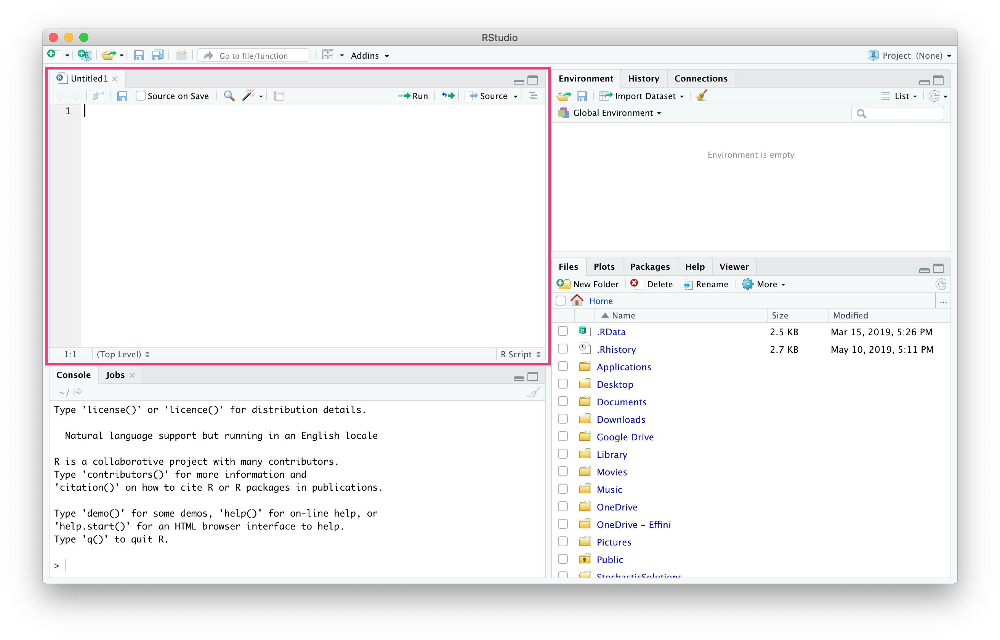
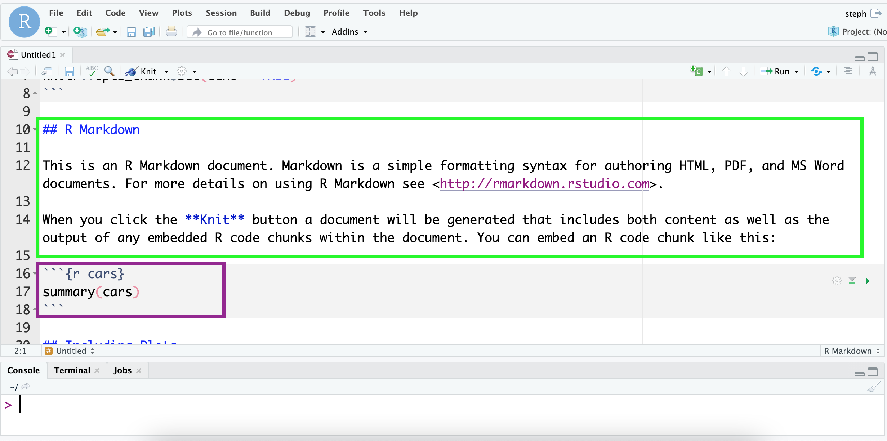
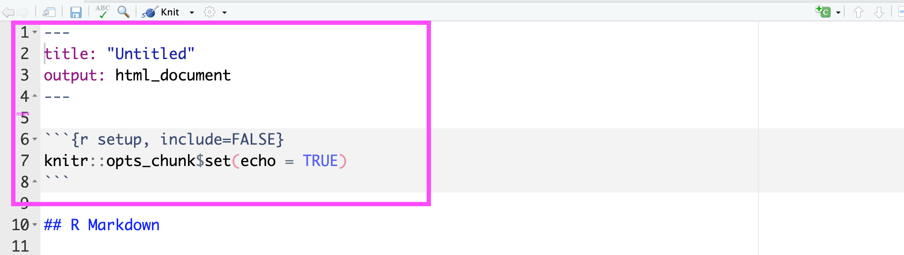
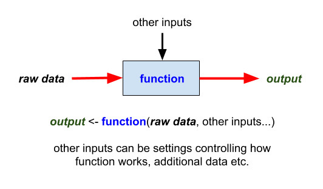
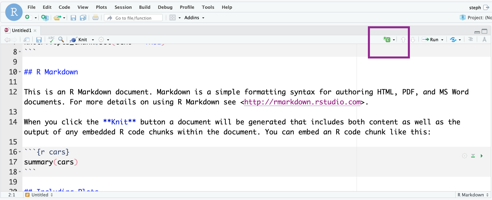
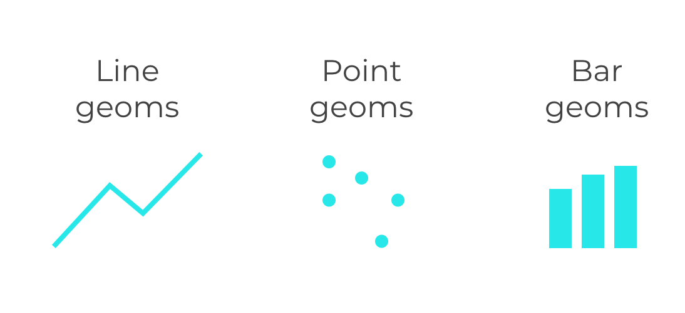

```{r setup, include=FALSE}
knitr::opts_chunk$set(echo = TRUE, fig.align = 'center')
```

<hr>

<br>
<details>
<summary>**Instructor notes**</summary>


* Introduce yourself and any assisting instructors
* Say a little about your roles at CodeClan
* Introduce the Data Analysis course: 
  * Talk a little about the contents of each module and the projects
  * Mention that the experience of learning to code in this session is similar to the teaching environment on the course
  
</details>
<br>

<hr>

# Introduction 

Welcome to CodeClan! In this session we hope to give you a small taste of modern data analysis in a state-of-the-art environment: the `R` scripting language. `R` was developed from the ground up with data analysis and statistics in mind. It offers many advanced tools for data cleaning and manipulation, visualisation and machine learning! Best of all, it is **free and open source**, so you can take what you learn here today, download `R` at home or at work, and continue using it, learning as you go! 

We'll cover:

* basic `R` coding
* importing data into `R` from spreadsheets 
* data manipulation using the `tidyverse` (a helpful collection of `R` packages)
* plotting using `ggplot`  

<hr>

# Netflix movie analysis

```{r, echo=FALSE, out.width = '80%'}

```

<br>

The dataset we're going to use consists of tv shows and movies available on Netflix as of 2019. The dataset is collected from Flixable which is a third-party Netflix search engine. You can find it on the [R for Data Science Tidy Tuesday's Github profile.](https://github.com/rfordatascience/tidytuesday/blob/master/data/2021/2021-04-20/readme.md)  


For this session, we will be looking at two separate questions:

* Were movies or tv shows more popular across the years?   
* Which year had the most releases?   

We will use R to answer these questions. 


<hr>

# What is R?

R is a programming language, specialised for data science and statistics. In `R` we manipulate, visualise and analyse data by writing and running **lines of code**. Clearly this differs from a spreadsheet using a **graphical user interface** (GUI), where we point and click, drag cells and select options from menus. If someone was watching over your shoulder while you write `R` code, they might think you were writing software rather than doing data analysis! In this session, we're going to learn how to do some basic data analysis using R. 

You might ask yourself "Why should I use `R` over a spreadsheet when I already know how to use that?" It's a valid question: learning a programming language is tricky! Initially, you'll probably do something more quickly in a spreadsheet than you will in `R`. However, there are a few key benefits to using `R`:

1. It is **re-usable**. Imagine you've spent a few hours manipulating data in a spreadsheet: doing calculations, and then making graphs. You get your output and you're happy. But then your boss comes to you and tells you that they mistakenly sent you the wrong spreadsheet, and now they're going to send the correct one. If you've been using a spreadsheet for the analysis, you're going to have to start again from scratch with the new sheet. But, if you had been using `R`, you could just re-run your code **with the new data** and it does all the analysis for you in a few seconds.

2. It is **reproducible**. Once you have written some `R` code, anyone can read and run your code to see **exactly** what you did to the data and what you calculated from it. This means you can share your code with colleagues and they can easily check your work. 

3. Spreadsheets can produce several types of basic graphs once you've chopped up your data and selected the portions you want to analyze. `R` is designed to produce graphs very easily without much preparation of data. It also provides more types of graphs than you’ll ever know what to do with!

<hr> 


# Using RStudio to write R code

We are going to use an IDE (interactive development environment) called RStudio. While you don't need it to write R code, RStudio makes writing R code easier.

R is free and open source. It is written by volunteers and all the packages you'll use are also written by volunteers.

RStudio is also free and open source, but is made by a profit-making company. They make their money by selling a professional version of RStudio that runs on a server and includes support.

Your RStudio should look something like this:

<br>

```{r, echo=FALSE, out.width = '80%'}

```


<br>


## Top right window (Environment, History, Connections)

There are several tabs here. The most important one is the environment tab. This shows you the objects you have created from writing code.

```{r, echo=FALSE, out.width = '80%'}

```


## Bottom left window (Console)

This is the console. This is where R code you write in the top left window gets run. You also might write code directly in here if you know you don't want to keep it.

```{r, echo=FALSE, out.width = '80%'}

```


## Bottom right window (Files, Plots, Packages, Help, Viewer)

Again, there are several tabs here. The most important ones are

- Files: see all the files in your project (more on projects later)
- Plots: see plots that you've created
- Help: view R's help files

```{r, echo=FALSE, out.width = '80%'}

```


## Top left window (Script)

You'll notice in our image we have an extra window. This is where we're going to write our code and save it. To do this, we need to open up a file we can write in. 

```{r, echo=FALSE, out.width = '80%'}

```


We're going to use a file type called **R Markdown** that lets you mix `R` code and the results of running code (tables, plots etc) with formatted text. It's a really useful format for creating reports, and you can output them in `.html` format (and, with slightly more work, as `.pdf` format). This is called **knitting** the markdown.

So, go up to `File -> New File -> R Markdown...`, choose `Document` from the left panel, make the `Title:` say 'CodeClan Taster' (this is the title that will show in your document, not the filename), put your name in `Author:` and keep the `Default Output Format:` set to `HTML`. Click `OK`. `RStudio` will create the file for you, and it will contain some helpful notes to help you get started, and a link to the R Markdown page on the `RStudio` website. We'll just get rid of this stuff for now: highlight everything apart the top section marked by `---` and delete it. Finally, go to `File -> Save As...`, enter a name for your file e.g. 'taster_session_analysis.Rmd' and click `Save`.  

We're going to be writing our analysis code in this `.Rmd` file. Don't forget to `Save` it often as you go (`File -> Save` or `ctrl + s`)! On with the show!

<hr>

You'll notice that RMarkdown brings up a default template, which has code and text all in one. 


```{r, echo=FALSE, out.width = '80%'}

```

<br> 

Text is shown in the green rectangle. You can treat this as a regular text document. Code chunks are shown in the purple rectangle. You can tell these are code chunks as they start and end with three backticks ```. You write code within these backticks.   

<br>

The standard document always comes up, but you can delete this now. As long as you don't delete the information in the header, (top of the document, held within three --- dashes), you'll be ok. 

```{r, out.width = "80%"}

```


# R packages and functions

In R, we need to make use of something called packages. A good analogy of packages in R is to think of a smart phone and the app store. The app store contains hundreds of thousands of apps available to download. You don't want to buy a smart phone and have them all installed - what a waste. Instead, you want to be able to go somewhere and install the apps you want once. These will then be on your phone, and you can use them by clicking the app icon and loading them up whenever you need to use them.

This is the same idea as a **package**. There are thousands of packages you can install on your own R to use. When you want to use a particular one, you load it into R. 

Think of a package as being like a **toolbox**. which contains useful tools. The useful tools inside a package are called **functions**.

<br> 

```{r, echo=FALSE, out.width = '60%'}

```

<br>

A function is just some code that someone else has written for you ahead of time to either **do something to data** or **calculate something from data**. As the figure below shows, a function normally takes in some raw data, takes in some other settings, and then outputs either modified data or something calculated from the data (e.g. a graph or a statistic)

<br>

```{r, echo=FALSE, out.width = '80%'}

```

<br>
<blockquote class='task'>
**Task - 1 min**

Have a think back if you have used Excel or another spreadsheet before - what functions have you used, if any?

<details>
<summary>**Possible Answers**</summary>
`SUM()`, `AVERAGE()`, `COUNT()`, `HLOOKUP()`, `VLOOKUP` etc.
</details>
</blockquote>
<br>

The package we are going to use today is called `tidyverse`. This is actually more than just a package, it is a collection of packages which contain lots of different tools to perform data analysis. The `tidyverse` is very widely used for data 'wrangling' amongst other tasks. By data wrangling we mean preparing data to be used in analysis tasks. [You can find a lot more information about it here.](https://www.tidyverse.org/)  

<br>

We have installed the package on our machines, but you will need to install it. To do this, in `RStudio`, go to the `Packages` tab, press the `Install` button, type `tidyverse` into the `Packages` textbox and press `Install`. `R` will download and install the package.

Now, to load it! Remember we said you only need to install a package once, but you will need to load it every time you want to use it. 

To load a package, we need to write some code to do this. First step - we need to insert a code chunk. You can do this by pushing on the green button shown below and choosing R as the language for the chunk. 
 
```{r, echo=FALSE, out.width = '80%'}

```

<br>

Next, we need to write some code into that chunk. For our first line of code, we're going to load in our package. We do this using the `library()` function. You can tell it's a function because of the way it's written: functions have `( )` after them. You then input the name of the package we want to load inside the function. We need to put it in the "  " syntax, to let R know we are giving it some text. 
One final thing to know is that if we want the code to work, we need to **run** it: just writing the code is not enough. Once you've typed the command, you can run it by pressing the green arrow in the code chunk. 

<br>

```{r}
library("tidyverse")
```

<br>

You can ignore a lot of the output, it's just telling you what it has loaded. 
<br>

Fab! Now we can move on and start loading our data.

<br>


# Loading in our data

The data we have is in `csv` format : comma separated value format. This is a pretty standard way of representing data files, and you may have come across them before. Our first task is to get that into R. 

The tidyverse thankfully has a function for everything you need, and in this case we can use the `read_csv()` function to read in this file. Functions tend to be named after what they do, so you get a good idea of what you're using from the name. Let's use this now.


```{r}
netflix <- read_csv("data/netflix.csv")

```

**Note that as you typed the command above, `RStudio` tries to help you, offering possible completions which you can select by pressing `tab`. You can also `tab` to help you complete the `"data/netflix.csv"` filename. Helpful, huh?**

Let's break down what this line of code does. It says 'use the `read_csv()` function to read the contents of `netflix.csv`, and store the data in a variable called `netflix`'. A variable is just a way to hold information in R. We have chosen the name `netflix` for it, but it doesn't have to be called this. You can call a variable anything you want, but do try and give it a sensible and meaningful name as this is best practice. 

You can quickly check if you've got loaded data by looking in your `RStudio` environment. In most `RStudio` desktop configurations, this is in the top right hand corner of the screen. If you see anything under the `Data` heading, it means you've got loaded data.  


Let's see the data we loaded. To do this, we're going to make use of more functions. 
First, let's use the `head` function, which lets us print out rows of our data. 

<br>

```{r}
head(netflix)
```
<br>

You can change how many rows `head()` prints out by including a number as an argument:

<br>

```{r}
head(netflix, 1)
```
<br> 

You can also use a few other functions to explore your data. For example, if you just want to see the names of all the variables (columns) in your dataset, you can use the `names()` function:

<br> 

```{r}
names(netflix)
```

<br>

If you want to see the overall dimensions of your data you can use the `dim()` function:

<br>

```{r}
dim(netflix)
```

These three functions are probably the most used ones to check your data when you first load it in. 

Great, now we've got the data, we're ready to do a bit of wrangling! 

<hr>

## `dplyr`: the most important six functions for data analysis

`dplyr` is a `tidyverse` package created for ‘data wrangling’. Analysts spend huge amounts of time wrangling data: `dplyr` aims to provide all the tools you need to do this in one handy package. Each `dplyr` function is known as a **verb** (something you **do to** or **do with** your data), and `dplyr` provides a function for each basic verb of data manipulation. Hadley Wickham, the creator of the `tidyverse`, has stated that these six functions should let you do 80% of the data wrangling you'll encounter! 
**instructor - write these up**

  * `select()`: include or exclude certain variables (columns)  
  * `filter()`: include or exclude certain observations (rows)  
  * `arrange()`: change the order of observations (rows)  
  * `mutate()`: create new variables (columns)  
  * `group_by()`: sort your data into groups  
  * `summarise()`: calculate summary statistics for groups or for data overall  

<br> 

We will be using these verbs to answer our analysis questions. 


# Data Pipes  
 
Before we get into actually working with our data, you have to understand the concept of a **data pipeline**. It's typical to use a few functions to manipulate and visualise data, and often we arrange these functions in **pipes**. All this means is that, at each step, we take the **output** from one function and pass it as the **input** to another. If you like, think of this as a production line in a factory: data goes along a conveyor belt, and each function is a machine on the line that does something with or to the data, before passing the data on to the next machine.

We accomplish all of this using the handy-dandy `pipe %>%` operator from the `maggittr` package in R.  

To help you understand this, let's look at how we might describe a real life process in terms of functions and pipes. Take the example below where we are baking a cake!

<br>

```{r, echo=FALSE, out.width = '80%'}

```

<br>

On the left, you have typical **programming** language syntax, where your calls to the various functions all work from the inside out. On the right, you have the version using the `tidyverse` pipe function `%>%`. Tidyverse pipes are all about arranging the code in a logical way, rather than the way the computer prefers makes it easier both for yourself and for others reading the code. This was the key idea behind creating the `pipe` workflow in the `tidyverse`. 

**A good rule for understanding pipes: translate `%>%` to the words “and then…”**. Doing this for the code above, it reads:  

* get the `ingredients`, **and then**  
* mix them, **and then**   
* pour them into baking form, **and then**  
* put them into the oven, **and then**  
* bake them for time 30 mins, **and then**  
* slice into 6 pieces, **and then**  
* eat 1 slice  
  
Pipes make analysis code easier to read and more efficient to write, in keeping with their design aims: “to decrease development time and to improve readability and maintainability of code”.

Great, now let's get into data wrangling and answering our questions! We're going to use the `dplyr` package (again, part of the `tidyverse`) to do this.


<hr> 

# Netflix Analysis 


Let's remind ourselves of our analysis questions: 

* Were movies or tv shows more popular across the years?   
* Which year had the most releases?   
  
Let's first look at our data and see what data we'll need to answer these.

<br>

```{r}
head(netflix)
```

<br> 

So, we'll need the `type` and `release_year` columns from this. We can incorporate this into our first analysis pipe later. 

Another thing we can do is check the unique entries we have in these columns before we begin. 

```{r}
netflix %>%
  distinct(type)
```

<br>

So, we have data for TV Shows and Movies only. Good to know. Now we can check the years we have.  

<br> 

```{r}
netflix %>%
  distinct(release_year) 
```
<br> 

We can also see we have data from 1943 until the year 2020. For the sake of this lesson, let's only focus on the last 20 years. Again, we can incorporate this in our pipe later.  

<br> 

# Were movies or tv shows more popular across the years? 

So we're ready to start writing our first pipe to answer our first question. Let's say want to find out how releases of each `type` there were each year since 2000. If we were doing this manually and we had a pile of sheets of paper, each containing details of a class, we would:

* Only filter out the data points that occur in years after (or equal to) 2000. 
* Sort the pile into separate smaller piles by **type** (this is the same as grouping the data by `type`)  
* Sort each pile by **year** (this is the same as grouping the data by `release_year`)  
* Count the number of sheets in each pile  

Let's put this all together. In `R` we do this by running a `filter()`, a `group_by()`, and followed by a call to `summarise()`. 


```{r}
netflix_groups <- netflix %>%
  filter(release_year >= 2000) %>%
  group_by(type, release_year) %>%
  summarise(total_year = n())

netflix_groups
```
<br> 

Great, we've just made our first table in R with our first pipe. Let's break down what it's doing in plain language:

* first, create a variable `netflix_groups` to store our final data once `R` finishes running the pipe
* take our `netflix` data, **and then**
* filter out only the years we want (>=2000)  
* pass it in to the `group_by()` function (we're asking `R` here to group the rows by `type` and `department`), **and then**
* pass the grouped data into the `summarise()` function (this totals the number of showings in each group)

There we go! In a few lines of code we have values for the numbers of movies/tv sbows in each year. 

Great, that's a useful table. Now let's see our first visualisation! 

## Plotting: let's create our first `R` plot

We're going to make use of the `ggplot2` package which `tidyverse` loaded for us earlier. 

`ggplot2` lets you make data visualisations; you can use it to create everything from simple bar graphs all the way up to detailed maps. It can take a while to get your head around how it works, but it's worth the effort, as it's very powerful!

There are four main parts of the basic `ggplot2` call: 

<br>

```{r, echo=FALSE, out.width = '80%'}
knitr::include_graphics("images/ggplot.png")
```
<br>

  * You start with the function `ggplot()`. This initiates plotting and that's all. Within this function you include the data you are plotting (or you can skip this, if data is being piped `%>%` into `ggplot`). 
  * Next is the `aes()` function. This allows you to choose which parts of your data you are going to plot. More precisely, it lets you map the variables in your data frame to the 'aesthetic attributes' of the geometric objects of your plot (position, shape, size, colour etc).
  * Rather than using pipes `%>%`, in `ggplot2` you use `+` to link components of your plot  
  * Finally, you add on a specific function for the type of plot you want. For example, if you wanted a bar chart, you would add on `geom_bar()`. More precisely, these are called the **geoms** of the plot: short for geometric shapes. Lines, points, and bars are all types of `geom`. These will become clearer once you start using them more.

<br>

```{r, echo=FALSE, out.width = '80%'}

```

<br>

That's pretty much `ggplot2` in a nutshell! You can build commands on top of each other to produce more and more complex plots, but ultimately it's just a repetition of this highly structured syntax. The name `ggplot2` is short for 'grammar of graphics plot': the workflow in `ggplot2` mirrors the 'grammar of graphics' concepts proposed by Leland Wilkinson: an attempt to make the structures of data visualisations more systematic! 

Let's make our first plot. 


```{r}
netflix_groups %>%
  ggplot(aes(x = release_year, y = total_year, group = type, colour = type)) + 
  geom_line() + 
  geom_point() + 
  xlab("Release year") + 
  ylab("Total movie count") + 
  ggtitle("Total number of netflix releases in the last 20 years")
```

<br> 

Let's break down what this command is doing:

* Pipe our data into the `ggplot()` function (since we are using a pipe, we don't need to include the data in the call  
* `aes(x = release_year, y = total_year, fill = type)` tells `ggplot2` we want year on the x-axis and the count on the y-axis, and that we want the fill (the colour) to be by what type of content it is.  
* `+ geom_line()` and `+ geom_point` tells `ggplot2` to plot a **line graph with points** 
* `xlab()` and `ylab()` set the axis labels, and `ggtitle` sets the title.  
  
<br>  

There you have it - your first visualisation in `R`! And it does let us answer our first question. 

> Were movies or tv shows more popular across the years?   

It looks like Movies were, until recently!

Great. Now we can answer our final question. 

<hr> 

# Which year had the most releases?   

<br> 

If we look again at our data table, we can actually find this out pretty easily using the `slice_min()` function. This will look through the table, and find the minimum values for your specified column, for each group. 

```{r}
netflix_groups %>%
  slice_min(total_year)
```

<br> 

If we want to find the max values, we can use the `slice_max()` function. 

<br> 

```{r}
netflix_groups %>%
  slice_max(total_year)
```

And there we go! Our questions answered. 


# Going further with `R`

Hopefully this short session has made you enthusiastic to find out more about data analysis in `R`! There's so much more we would have loved to tell you if we had the time. Here are some suggested resources if you'd like to go further:

* Have a look at our full 14-week data analysis course if you would like to build the skills to let you work in this exciting field!
* Watch this space at CodeClan for forthcoming short courses on data analysis in `R` and `Python` taught in a similar style to this session
* The classic book on data analysis in the `tidyverse` is 'R for Data Science' by Hadley Wickham and Garrett Grolemund. You can either buy a paper copy of this, or find it legitimately available for free [here](https://r4ds.had.co.nz/)
* There are a number of excellent online courses available on `R`. [This](https://www.udemy.com/course/data-science-and-machine-learning-bootcamp-with-r/) is quite a good starting course, but don't buy it at full price!

